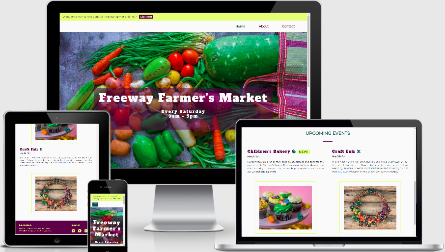

# **Milestone Project 1**

# Table of Contents
1. [Purpose](#purpose)
2. [Details](#details)
	1. ['Home' page](#homepage)
	2. ['About' page](#aboutpage)
	3. ['Contact' page](#contactpage)
3. [Responsivity](#responsivity)
4. [UX (User Experience)](#userexperience)
	1. [Strategy Plane](#strategy)
	2. [Scope Plane](#scope)
	3. [Structure Plane](#structure)
	4. [Skeleton Plane](#skeleton)
	5. [Surface Plane](#surface)
5. [User Stories](#userstories)
	1. [First Time User](#firsttimeuser)
	2. [Returning User](#returninguser)
	3. [Frequent User](#frequentuser)
6. [Design](#design)
	1. [Wireframes](#wireframes)
	2. [Colour Palette](#colourpalette)
	3. [Images](#images)
	4. [Typography](#typography)
	5. [Current Features](#currentfeatures)
	6. [Future Features](#futurefeatures)
7. [Testing](#testing)
	1. [General Testing (user/functional/layout for all pages)](#generaltesting)
	2. [Bug Fixes](#bugfixes)
	3. [Browser Compatability](#browsercompatability)
	4. [Device Compatability](#devicecompatability)
8. [Validation](#validation)
9. [Technologies](#technologies)
	1. [Languages](#languages)
	2. [Frameworks and Libraries](#frameworks)
    3. [Layout and Testing](#layouts)
10. [Deployment](#deployment)
	1. [Website Creation in Notepad++](#websitecreation)
	2. [Website Build in GitHub and GitPod](#websitebuild)
	3. [Viewing the Live Website with GitHub Pages](#viewinglive)
11. [Credit and Acknowledgements](#creditandack)
	1. [Mentor](#mentor)
	2. [Code](#code)
	3. [Images](#images2)
	4. [Text Content](#textcontent)

## Freeway Food Market Website

### **Purpose** 

The purpose of this website is to provide information to potential customers and vendors alike on the
history of the Freeway Farmer's Market, and to advertise the general products, dates, times and location
of the market, including upcoming events. 

Customers will know when and where to attend the market, how to contact the market coordinator,
what type of goods are available, when special events are taking place, and how to receive a newsletter.
Potential vendors will be able to enquire about renting a stall at the market.

The site is responsive on a variety of devices, and features are easily accessible to all site visitors.

### **Details** 

#### **'Home' page** 

The 'Home' page header contains an alert that draws the attention of potential vendors, and a button (or link on mobile view) that leads potential vendors to
a form modal enabling them to enquire about renting a stall to sell goods at the market. The form
contains name, phone and email fields, and a submit button. The alert/form is available on all 3 pages.

This is a key feature for the client, as renting stalls ensures continuation of the business and the ability
to pay rent for the market space. It also ensures more variety is available for customers.

The navigation menu contains Home, About and Contact links (3-page website).

The name and opening hours of the market overlay the main image in the body of the homepage
(jumbotron).

The 'Upcoming Events' section details new and upcoming events where goods are sold outside of the
usual market fare (special interest or non-food related items, such as crafts). Related images included.

The footer contains the addresses for the market venue and office, as well as social media links.

#### **'About' page** 

This page contains the same header and footer information as the homepage. The body of the page
contains the name of the market with a portion of the homepage main image as a background.

An 'About the Market' section displays text passages which outline the history of
the market and provides details on what goods are for sale. Related images included.

#### **'Contact' page** 

The contact page contains the same header and footer information as the homepage. The body of the
page contains the name of the market with a portion of the homepage main image as a background.

A 'Contact Us' section displays name, address, phone and email information
beneath a 'Details' heading (left) and a 'Newsletter' email submission form and image (right). In mobile
view the 'Newsletter' appears beneath the 'Details' and the image is removed. Clicking on the button currently resets the form field if an email address is entered.

### **Responsivity** 

The website for the Freeway Farmer's Market is responsive across a number of browsers, devices and
orientations. In the mock-ups, the scrollbar has been used to show the lower part of the pages in some
instances. The various mock-ups also highlight parts of each page which relate to the user stories, e.g. newsletter, social media icons in the footer. Mock-ups for the [About](assets/images/mockups/mockup_2.png) and [Contact](assets/images/mockups/mockup_3.jpg) pages are also available.

### **UX (User Experience)** 

#### **Strategy Plane** 

The website is required to generate income for the client by promoting the market to both customers
and vendors. The user’s needs are met, as the site provides relevant and accessible information, forms and links.

#### **Scope Plane** 

Features available in the website include an alert that encourages potential vendors to contact the site
owners at the click of a button. A newsletter can be easily subscribed to on the 'Contact' page (currently resets the form, JS required). Social
media icons (currently linking to the site's homepages) are available in the footer on all pages. Address
and contact details are also available.

#### **Structure Plane** 

The structure of the website is uncluttered and easily navigated. Users can move between the 3 site
pages via the navigation menu items. Ample opportunity is provided to contact the client, for example,
via the alert button, the 'Contact' navigation menu link address details in the footer. 
Social media links are also available in the footer, currently leading to the homepage of each site (these would lead to active accounts if
the business was live). 

#### **Skeleton Plane** 

Wireframes were created to plan the initial layout of each webpage, detailing where each section,
button and link would be placed. For example, it was determined that adding a form modal to the alert
aimed at vendors may encourage them to apply to rent a stall moreso than if the alert was not present, or if it was present without the button/link.
Layout of text and images and how each site page would look at various sizes were also determined.

#### **Surface Plane** 

The colour palette was chosen to reflect the enticing, fresh, vitality-based qualities of the products.
The font families suit the theme of the website and product also. The images are dynamic and bright,
and do not clash with the site colour palette. The light background throughout adds to the fresh, light feel that suits the topic.

### **User Stories** 

#### **First Time User** 

- I can immediately see what the site's purpose is and I quickly know that it is the site I intended
    to view
- I can smoothly navigate between the three website pages available
- Each page of the website contains the details I was expecting, e.g., the 'About' page contains
    information on the market and what it provides
- I am able to easily enquire about selling at the market, or receive a newsletter should I wish to
    do so
- I can view the site and navigate as expected on my mobile phone, tablet or laptop/desktop
- I can access the related social media platforms provided

#### **Returning User** 

- I can check what new updated events are available, after previously noting this section on my initial
    visit
- I can subscribe to the newsletter, after previously noting where the subscription form is located
- I know where to go to access the phone number/email addresses of the business owners

#### **Frequent User** 

- I regularly check on upcoming events, and I also check to see if additional products have been
    added
- I can apply to be a seller at the market as I know the type of products usually sold there, where the enquiry form is located and what
    information is required

### **Design** 

#### **Wireframes** 

Wireframes were created in [Balsamiq](www.balsamiq.com). Full size wireframe images are available [here](assets/images/wireframes).

_Home Page_ 

_About Page_ 

_Contact Page_ 

#### **Colour Palette** 

I chose the colour palette using the [Coolors](www.coolors.co) website. The main colours used on the
site are 'Dark Byzantium' #4D243D (aubergine) and 'Mindarc' #E9FF70 (light green).

#### **Images** 

The images on the site were sourced from [Unsplash](www.unsplash.com). Further details available in
the Credits and Acknowledgments section.
The images are not skewed or pixelated on the site. Each image presented is surrounded by a light green border for consistency throughout the site.

#### **Typography** 

Fonts used on the site were sourced from [Google Fonts](www.fonts.google.com). The main headings are
displayed in 'Alfa Slab One' and the text sections are presented in 'Montserrat'. Fonts were paired in
Google Fonts as being compatible.

#### **Current Features** 

- The navigation bar is presented as a toggle button in mobile view, and the user can click on it to
    reveal or conceal the navigation menu.
- The alert contains a button that opens a form modal where the user can enter their details as
    requested, and press the 'Submit' button. This is presented as a link in mobile view.
- The 'About' page contains a newsletter submission button, preceded by an email address field.
- The footer contains clickable social media links.

#### **Future Features** 

- Confirmation pop-up when user submits form modal (alert bar). JavaScript required
- 'Subscribe to Newsletter' button currently does not send information, it resets the input field when clicked. JavaScript is required to send information and provide a confirmation pop-up
- Social media links to actual account related to the site/business

### **Testing** 

This is a static website so testing is limited to visual inspection, layout, link interaction, and compatibility
with various browsers/devices/orientations.

#### **General Testing (user/functional/layout for all pages)** 

| Action                              | Expected Result  | Result           | Status|
| :----------------------------------- | :---------------- | :---------------- | :----- |
| Click on the alert bar button       | Form modal opens | Form modal opens | Pass  |
| Click on the alert bar button in mobile view       | Form modal opens | Form modal opens | Pass  |
| Populate the fields with suitable entries       | Fields populated  | Fields populated  | Pass  |
| Click ‘Submit’ or ‘x’        | Modal closes  | Modal closes  | Pass  |
| Click on the navigation items        | Expected pages open  | Expected pages open  | Pass  |
| Click on the toggle button and navigation buttons in mobile view       | Navigation items are displayed and expected pages open  | Navigation items are displayed and expected pages open  | Pass  |
| Scroll to bottom of the screen        | No visual or technical issues  | No visual or technical issues  | Pass  |
| Click on each social media link icon in footer        | Site homepage is displayed in its own browser page  | Site homepage is displayed in its own browser page  | Pass  |
| In the ‘Contacts’ page, add email address to ‘Newsletter’ field        | Email address drop-down present, email address entered successfully  | Email address drop-down present, email address entered successfully  | Pass  |
| In the ‘Contacts’ page, click on the 'Submit to Newsletter' button        | Field is reset, email address entered no longer present  | Field is reset, email address entered no longer present  | Pass  |
| In the ‘Contacts’ page, click on the phone number(s)       | ‘Make a Call’ pop-up is displayed  | ‘Make a Call’ pop-up is displayed  | Pass  |
| In the ‘Contacts’ page, click on the email address(es)        | Default email program is launched  | Default email program is launched  | Pass  |

#### **Bug Fixes** 

A button is present in the alert at the top of each page, which leads to a form modal. At small device dimensions this button changes to a link. 
There was an overlap on medium sized screens where the button and link were visible at the same time. 
This bug was fixed using a media query in the CSS stylesheet.

#### **Browser Compatability** 

Tested with Chrome, Safari and Microsoft Edge. Compatible with each browser.

#### **Device Compatability** 

Viewed on a variety of phones and tablets via the ‘Inspect’ tool in Chrome, Safari and Microsoft Edge. Tested on ['Am I Responsive?'](http://ami.responsivedesign.is/) site.
Compatible at portrait and landscape orientations. 

### **Validation** 

**HTML:** https://validator.w3.org/nu/?doc=https%3A%2F%2Fsaraholoughlin5.github.io%2FMilestone-Project-1%2F

**CSS:** https://jigsaw.w3.org/css-validator/validator?uri=https%3A%2F%2Fsaraholoughlin5.github.io%2FMilestone-Project-1%2Fassets%2Fcss%2Fstyle.css&profile=css3svg&usermedium=all&warning=1&vextwarning=&lang=en

### **Technologies** 

#### **Languages** 

HTML and CSS were used to build and style the website

#### **Frameworks and Libraries** 

[GitHub](https://github.com/) 
Cloud-based repository service that hosts the website’s source files

[GitPod](https://gitpod.io/workspaces/) 
Development environment

[Notepad++](https://notepad-plus-plus.org/) 
Offline source code editor

[Bootstrap V4.3](https://getbootstrap.com/) 
Provides pre-defined classes for elements of a website, which can be restyled as required using CSS.
Used for a variety of items in the website, such as the alert, jumbotron and modal.

[Font Awesome](https://fontawesome.com/) 
Provides free icons that can be restyled with CSS. Used in page content headings and social media links
in the footer.

[Google Fonts](https://fonts.google.com/) 
Provides links to a large variety of fonts and related compatible paired fonts. ‘Alfa Slab One’ and
‘Montserrat’ used throughout this website.

[PX-to-REM](https://nekocalc.com/px-to-rem-converter) 
This site was used to convert px to rem

#### **Layout and Testing** 

[Balsamiq](https://balsamiq.com/) 
Wireframe were created on the Balsamiq cloud-based platform

[Am I Responsive?](http://ami.responsivedesign.is/) 
Used to create mock-ups of each page of the website

[W3C HTML Validation](https://validator.w3.org/) 
Used to validate the HTML code of the website

[W3C CSS Validation](https://jigsaw.w3.org/css-validator/) 
Used to validate the CSS code of the website

### **Deployment** 

#### **Website Creation in Notepad++** 
The website framework was built offline in Notepad++ and copied to GitPod at various milestones.

#### **Website Build in GitHub and GitPod** 

In GitHub, I logged in and clicked on the ‘New’ button in the left-hand menu. On the ‘Create a New Repository’ page, I clicked on the ‘Repository Template’ button and chose the ‘Code Institute’ template provided.
I checked the ‘Include all branches’ tick-box. I entered ‘MilestoneProject-1’ in the ‘Repository Name’ field, left the radio button checked at ‘Public’, and clicked on the ‘Create Repository’ button. 

Once in the new repository, I clicked on ‘GitPod’ in my browser extensions to open the workspace. The ‘index.html’ and ‘style.css’ files were created, with the CSS file being added to the ‘assets/css’ folder.
Much of the code was initially created in Notepad++ then copied to GitPod. Site was updated using GitPod. Images were added to the ‘assets/images’ folder. 
The following command was entered in the terminal to open port 8000 to view the html file in the browser: ‘python3 -m http.server’. 

Commands were also used to add files, commit changes with comments, push to the repository: git add, git commit and git push. 
The status was checked using ‘git status’.

#### **Viewing the Live Website with GitHub Pages** 

In the MilestoneProject-1 repository on GitHub, I clicked on the ‘Settings’ tab and scrolled down to the
GitHub Pages section. I chose ‘Master Branch’ and ‘Save’, then I clicked on the link to successfully view
the live page. This link was also used for responsivity and validation checks.

### **Credits and Acknowledgements** 

#### **Mentor** 
Thank you to Spencer Barriball for his valuable feedback

#### **Code** 
To zoom on hover for the navigation items and social media icons, I used and restyled [this](https://www.w3schools.com/howto/howto_css_zoom_hover.asp) W3Schools code.

Main components of the website, such as the alert, buttons, jumbotron and modal, were restyled
versions of code made available via course lessons.

#### **Images** 

All images were downloaded from [Unsplash](https://unsplash.com/). Credited as follows:

| Name                                | Image                                       |
| :---------------------------------- | :------------------------------------------ | 
| Ratul Ghosh                         | Main [background image](assets/images/home.jpg) on all pages          |
| Caitlin de Wild                     | [Image 1](assets/images/childbake1.jpg) on the 'Home' page                  |
| Evgeny Dzhumaev                     | [Image 2](assets/images/craftevent.jpg) on the 'Home' page                  |
| Sigmund @sigmund                    | [Image 1](assets/images/about2.jpg) on the 'About' page                 |
| CDC @cdc                            | [Image 2](assets/images/about3.jpg) on the 'About' page                 |
| Austin Distel                       | [Image 1](assets/images/newsletter.jpg) on the Contact page                 |

#### **Text Content** 
All text presented on the website was prepared by me.